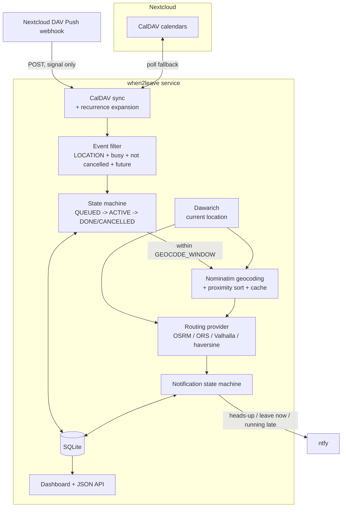

<p align="center">
  
</p>

# when2leave

**when2leave** watches a Nextcloud calendar, tracks your real-time location, computes
live travel time to your next qualifying event, and tells you — via
[ntfy](https://ntfy.sh) — exactly when you need to leave. It recomputes as you move, so
the "leave by" time adapts to traffic and to wherever you currently are, not just to a
static estimate made when the event was created.

It ships as a single self-hosted Docker container with a small dashboard, a JSON API,
and everything configured through environment variables.

> [!NOTE]
> **AI-authorship disclosure.** This project — source code, tests, Docker packaging,
> CI workflow and this README — was generated by [Claude Code](https://claude.com/claude-code)
> (Anthropic) from a detailed specification. It has not been run against a real
> Nextcloud/Dawarich/ntfy deployment. **Review the code and test it thoroughly against
> your own infrastructure before relying on it for anything time-sensitive.**

## Why

Calendar reminders fire at a fixed offset before an event, regardless of where you
actually are or how bad traffic is. when2leave instead asks: *given where I am right
now and how long it will actually take to get there, when do I need to leave?* — and
keeps re-asking that question as you move, so the answer stays accurate up to the
moment you should walk out the door.

## How it works



1. **Sync** — connects to Nextcloud over CalDAV, expands recurring events into concrete
   upcoming instances, and reacts near-instantly to changes via DAV Push (with a
   periodic poll as a safety net / fallback).
2. **Filter** — only events with a non-empty `LOCATION`, marked busy
   (`TRANSP:OPAQUE`), not cancelled, and in the future are tracked.
3. **State machine** — each tracked event instance is `QUEUED` until it's within
   `GEOCODE_WINDOW` of starting, then goes `ACTIVE` (geocoded + recomputed on a timer),
   then `DONE` once it starts. Events that stop qualifying become `CANCELLED`/`DROPPED`.
4. **Geocode** — resolves `LOCATION` via OSM Nominatim, fetching several candidates and
   picking the one closest to your current location (so "Main Street" doesn't resolve
   to the wrong country). Results are cached per address string.
5. **Locate** — fetches your latest tracked point from [Dawarich](https://dawarich.app)
   on every recompute.
6. **Route** — computes travel time via a pluggable routing provider (OSRM,
   OpenRouteService, Valhalla, or a no-dependency haversine+speed fallback).
7. **Notify** — computes `leave_at = event_start - travel_time - PREP_BUFFER` and sends
   a heads-up, a "leave now", or a one-shot "running late" notice via ntfy — without
   spamming you on every 5-minute recompute.

## Features

- Real-time, self-recomputing "when to leave" tracking driven by live location and
  live travel time.
- Near-instant calendar-change detection via [WebDAV Push](https://github.com/bitfireAT/webdav-push),
  with automatic polling fallback.
- Recurring-event expansion, timezone-correct (all internal comparisons in UTC).
- Proximity-aware geocoding with per-address caching, respecting the Nominatim usage
  policy (custom `User-Agent`, throttling, self-hostable).
- Pluggable routing: OSRM, OpenRouteService, Valhalla, or a dependency-free haversine
  fallback.
- A no-spam notification state machine: heads-up, leave-now, and running-late tiers,
  re-notifying only when things get meaningfully worse.
- A lightweight dashboard (Jinja2 + htmx, no JS build step) with live status, active
  event tracking (with full per-event location-update history), a queue of upcoming
  events, and a JSON API behind it.
- Everything configured via environment variables, validated at startup.
- Structured JSON logs, `/health` endpoint, graceful shutdown, retries/backoff on all
  external calls, non-root Docker image with a `HEALTHCHECK`.

## Quickstart (docker compose)

```bash
git clone https://github.com/arnyminerz/calendar-notifier.git when2leave
cd when2leave
cp .env.example .env
# edit .env with your Nextcloud / Dawarich / ntfy details (see below)
docker compose up -d
```

Then open `http://<host>:8080` for the dashboard.

`docker-compose.yml` pulls the published multi-arch image from GHCR
(`ghcr.io/arnyminerz/calendar-notifier`) by default; uncomment `build: .` to build from
source instead.

## Configuration

All configuration is via environment variables (see `.env.example` for a fully
commented copy). Duration values accept human-friendly strings: `30s`, `5m`, `12h`,
`1d`, or a bare number of seconds.

| Variable | Purpose | Default |
|---|---|---|
| `CALDAV_URL` | Nextcloud CalDAV base URL | — (required) |
| `CALDAV_USERNAME` | Nextcloud user | — (required) |
| `CALDAV_PASSWORD` | Nextcloud **app password** | — (required) |
| `CALDAV_CALENDARS` | Comma-separated calendar names/URLs; empty = all | (all) |
| `DAVPUSH_ENABLED` | Use DAV Push for instant updates | `true` |
| `DAVPUSH_CALLBACK_URL` | Public URL of the push receiver on this service | — |
| `POLL_INTERVAL_SECONDS` | Fallback/safety-net poll interval | `900` |
| `DAWARICH_URL` | Dawarich base URL | — (required) |
| `DAWARICH_API_KEY` | Dawarich API key | — (required) |
| `NOMINATIM_URL` | Nominatim base URL | `https://nominatim.openstreetmap.org` |
| `NOMINATIM_USER_AGENT` | Required by OSM policy | — (required) |
| `NOMINATIM_EMAIL` | Optional contact per OSM policy | — |
| `NOMINATIM_RATE_LIMIT_SECONDS` | Min seconds between Nominatim calls | `1` |
| `GEOCODE_CANDIDATES` | Candidates to fetch and sort by proximity | `5` |
| `ROUTING_PROVIDER` | `osrm` \| `openrouteservice` \| `valhalla` \| `haversine` | `osrm` |
| `ROUTING_URL` | Routing server base URL | provider default |
| `ROUTING_API_KEY` | For providers that need it (e.g. ORS) | — |
| `TRAVEL_MODE` | driving/cycling/walking | `driving` |
| `FALLBACK_AVG_SPEED_KMH` | Average speed for the haversine routing fallback | `40` |
| `GEOCODE_WINDOW` | Max time before event to start external lookups | `12h` |
| `RECOMPUTE_INTERVAL` | How often to recompute while active | `5m` |
| `NOTIFY_LEAD` | Heads-up before `leave_at` | `15m` |
| `PREP_BUFFER` | Extra time to get ready before leaving | `10m` |
| `NOTIFY_RESHIFT_THRESHOLD` | Min. worsening of `leave_at` to re-notify | `5m` |
| `NTFY_URL` | ntfy server | `https://ntfy.sh` |
| `NTFY_TOPIC` | ntfy topic | — (required) |
| `NTFY_TOKEN` | ntfy auth token (if protected) | — |
| `NTFY_PRIORITY` | Default ntfy priority | `default` |
| `HTTP_HOST` / `HTTP_PORT` | Dashboard/webhook bind | `0.0.0.0` / `8080` |
| `DASHBOARD_AUTH` | Optional `user:pass` for the UI | — |
| `DATABASE_PATH` | SQLite path | `/data/when2leave.db` |
| `TZ` | Timezone | system |
| `LOG_LEVEL` | Log level | `INFO` |

### Setting up each dependency

#### Nextcloud app password

Go to **Settings → Security → Devices & sessions**, and under "Create new app
password", give it a name (e.g. `when2leave`) and copy the generated password into
`CALDAV_PASSWORD`. Never use your real account password.

#### DAV Push (`nc_ext_dav_push`)

DAV Push gives near-instant calendar-change detection instead of waiting for the next
poll. It's implemented per the draft
[webdav-push](https://github.com/bitfireAT/webdav-push/) specification, matching
Nextcloud's [`nc_ext_dav_push`](https://github.com/bitfireAT/nc_ext_dav_push) app:

1. Install the `dav_push` app on your Nextcloud instance (App Store, or
   `occ app:install dav_push`).
2. Set `DAVPUSH_CALLBACK_URL` to a **publicly reachable** URL that routes to this
   service, e.g. `https://when2leave.example.com/davpush` (behind your reverse proxy).
3. On startup (and after every full sync), when2leave:
   - Sends `OPTIONS` to each tracked calendar collection and checks for `webdav-push`
     in the `DAV` response header.
   - If present, sends `PROPFIND` for the `{https://bitfire.at/webdav-push}`
     `transports`/`topic`/`supported-triggers` properties.
   - Generates a fresh EC P-256 keypair + random auth secret (a spec-valid Web Push
     subscription) and `POST`s a `push-register` request to the collection, with
     `push-resource` set to `{DAVPUSH_CALLBACK_URL}/{per-calendar-token}` and a
     `content-update` trigger.
   - Stores the returned `Location` (registration URL) and `Expires` in SQLite, and
     renews it automatically (checked every 30 minutes, renewed within 1 hour of
     expiry).
4. When Nextcloud POSTs to that callback URL, when2leave triggers a full CalDAV
   re-sync of the affected calendar in the background and responds immediately.

   **Note on encryption:** the full Web Push protocol (RFC 8291) encrypts push bodies
   against the subscriber's public key, meant for browsers relaying through a push
   service. Decrypting that payload isn't necessary for correctness here — we always
   resolve the actual change via a normal CalDAV fetch — so we deliberately treat any
   POST to a known callback token as "this collection changed" rather than
   implementing a hand-rolled AES-128-GCM/ECDH decryption path. See the module
   docstring in `when2leave/davpush.py` for the full reasoning.

If `nc_ext_dav_push` isn't installed, isn't enabled, or `DAVPUSH_CALLBACK_URL` is
unset, `DAVPUSH_ENABLED` is automatically treated as `false` at startup and the service
runs on polling alone (`POLL_INTERVAL_SECONDS`).

#### Dawarich API key

In your [Dawarich](https://dawarich.app) instance, go to your account settings and
create/copy an API key into `DAWARICH_API_KEY`. when2leave calls
`GET /api/v1/points?per_page=1&order=desc` to fetch your latest tracked point on every
recompute cycle.

#### ntfy topic

Pick a topic name (treat it like a password if using the public `ntfy.sh` server —
anyone who knows the topic name can read it) and subscribe to it in the
[ntfy app](https://ntfy.sh/app) or via the web UI. Set `NTFY_TOPIC` accordingly, and
optionally self-host your own ntfy server and set `NTFY_URL`/`NTFY_TOKEN`.

#### Routing provider

- **OSRM**: the public demo server (`https://router.project-osrm.org`) works
  out-of-the-box for light use but has rate limits and no SLA — self-host for anything
  serious ([OSRM backend](https://github.com/Project-OSRM/osrm-backend)).
- **OpenRouteService**: get a free API key at [openrouteservice.org](https://openrouteservice.org/dev/#/signup)
  and set `ROUTING_API_KEY`.
- **Valhalla**: point `ROUTING_URL` at a self-hosted or public
  [Valhalla](https://github.com/valhalla/valhalla) instance.
- **haversine**: no external service at all — estimates travel time as straight-line
  distance divided by `FALLBACK_AVG_SPEED_KMH`. Also used automatically as a transient
  fallback if the configured provider is temporarily unreachable.

#### Nominatim usage policy

The public `https://nominatim.openstreetmap.org` server requires a descriptive
`User-Agent` (and appreciates a contact email) and caps usage at roughly 1 request/second
with no heavy/bulk use — see the
[Nominatim Usage Policy](https://operations.osmfoundation.org/policies/nominatim/).
when2leave enforces `NOMINATIM_RATE_LIMIT_SECONDS` client-side and caches every
resolved address indefinitely, so steady-state usage is very light — but for anything
beyond personal use, please [self-host Nominatim](https://github.com/mediagis/nominatim-docker)
and point `NOMINATIM_URL` at it.

## Dashboard

A single page (auto-refreshing via htmx polling every 15s) shows:

- **Status header** — last CalDAV sync time, Dawarich reachability, DAV Push
  subscription count, and per-section counts.
- **Active** — every actively-tracked event: title, start time, resolved address,
  current distance, current travel time, computed `leave_at`, notification state, and
  time until the next recompute. Click a row to expand its full location-update
  history.
- **Queued** — qualifying events not yet within the geocode window, with the time each
  will enter active tracking.
- **Recently done/dropped** — a short recent history.

JSON API: `GET /api/events`, `GET /api/events/{id}/updates`, `GET /health`. Optionally
protect the dashboard and API with HTTP Basic auth via `DASHBOARD_AUTH`.


## Architecture / module overview

```
when2leave/
├── config.py        # pydantic-settings; env vars, duration parsing, validation
├── db.py             # SQLAlchemy 2.x models (Event, LocationUpdate, GeocodeCache, KV, DavPushSubscription)
├── caldav_sync.py     # CalDAV client, event filtering, recurrence expansion
├── davpush.py        # WebDAV Push discovery/registration/renewal + key generation
├── geocoding.py      # Nominatim client, haversine, proximity candidate selection
├── location.py       # Dawarich client (current location)
├── routing.py        # OSRM/ORS/Valhalla/haversine travel-time providers
├── notifier.py       # leave_at computation, notification state machine, ntfy client
├── tracker.py         # Ties it all together: sync, recompute loop, DAV Push wiring
├── web.py            # FastAPI app: dashboard, JSON API, DAV Push webhook
├── main.py           # Entrypoint: wires everything, APScheduler jobs, uvicorn.run
├── logging_config.py  # Structured JSON logging
└── templates/         # Jinja2 + htmx dashboard templates
```

Everything — dashboard, JSON API, and the DAV Push webhook receiver — is served by the
same FastAPI app on one port. APScheduler drives three background jobs: the poll-sync
safety net (`POLL_INTERVAL_SECONDS`), the active-event recompute loop
(`RECOMPUTE_INTERVAL`), and DAV Push subscription renewal.

## Local development

Requires Python 3.12+.

```bash
python -m venv .venv && source .venv/bin/activate
pip install -e ".[dev]"

cp .env.example .env   # fill in required values
ruff check . && ruff format --check .
mypy when2leave
pytest

# run the service locally
when2leave
# or: python -m when2leave.main
```

## Limitations & notes

- **DAV Push is experimental.** The underlying spec is a draft and Nextcloud's
  `nc_ext_dav_push` app is early-stage; when2leave's receiver treats any authenticated
  POST to a known callback token as "re-sync this calendar" rather than decrypting the
  Web Push payload (see the DAV Push section above). The polling fallback always runs,
  so correctness never depends on DAV Push working.
- **Public Nominatim/OSRM have real usage limits.** They're fine for personal use with
  the built-in throttling and caching, but self-host both for anything beyond that —
  see the setup notes above.
- **Recurrence expansion window** is currently a fixed 30-day lookahead
  (`DEFAULT_LOOKAHEAD_DAYS` in `caldav_sync.py`), not separately configurable via env var.
- **This is AI-generated code reviewed for structure and tested with mocked
  externals**, but it has not been exercised against a real Nextcloud, Dawarich, or
  ntfy deployment. Please test carefully — especially the DAV Push flow — before
  depending on it for anything time-sensitive.

## License

[MIT](LICENSE).
